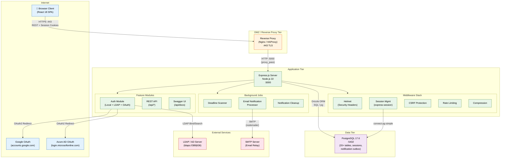

# OnBoardPro Production Network Diagram

## Network Tiers

| Tier | Component | Port | Protocol |
|------|-----------|------|----------|
| **Internet** | Browser Client (React 18 SPA) | — | HTTPS |
| **Internet** | Google OAuth | — | HTTPS (OAuth2) |
| **Internet** | Azure AD OAuth | — | HTTPS (OAuth2) |
| **DMZ** | Reverse Proxy (Nginx/HAProxy) | 443 | TLS termination |
| **Application** | Express.js (Node.js 22) | 5000 | HTTP |
| **Data** | PostgreSQL 17.6 | 5432 | TCP (SQL) |
| **External** | LDAP / Active Directory | 389/636 | LDAP/LDAPS |
| **External** | SMTP Relay | 25/465/587 | SMTP/SMTPS |

## Data Flows

1. **Client → App**: Browsers connect via HTTPS to the reverse proxy, which terminates TLS and forwards to Express on port 5000. Session cookies are used for authentication.
2. **Auth → Identity Providers**: The auth module handles OAuth2 redirects to Google and Azure AD, and LDAP bind/search operations to the directory server.
3. **App → Database**: All persistence goes through Drizzle ORM to PostgreSQL, including session storage via `connect-pg-simple`.
4. **Jobs → SMTP**: The email notification processor sends outbound emails via nodemailer through the configured SMTP relay.

## Middleware Stack

- **Helmet** — Security headers (CSP, HSTS, X-Frame-Options, etc.)
- **Compression** — gzip/brotli response compression
- **Session Management** — `express-session` with PostgreSQL-backed store
- **CSRF Protection** — Token-based CSRF mitigation
- **Rate Limiting** — Per-endpoint rate limit counters (stored in PostgreSQL)
- **Request ID** — Unique request tracking for logging and debugging
