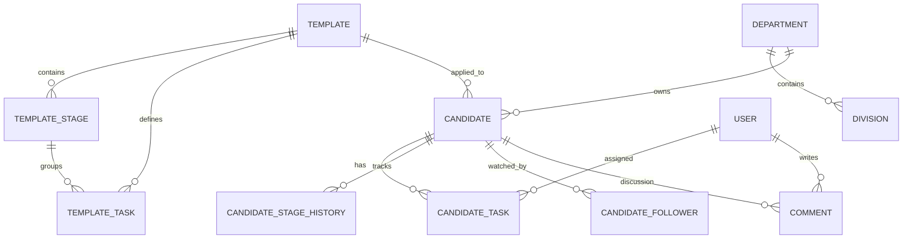
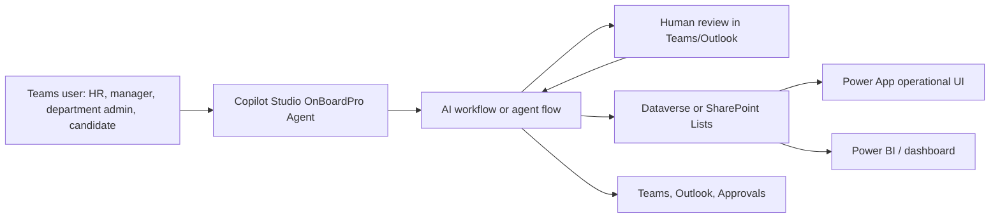
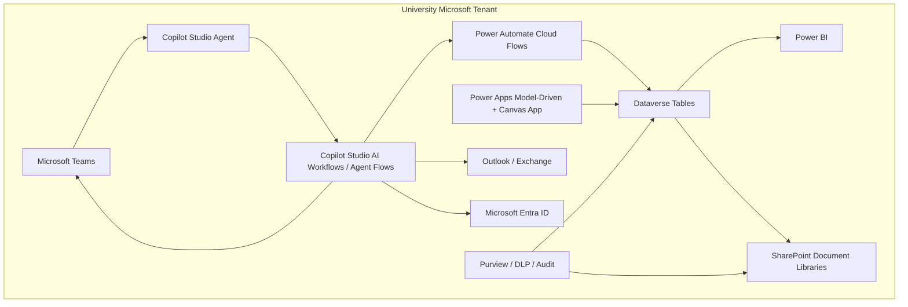
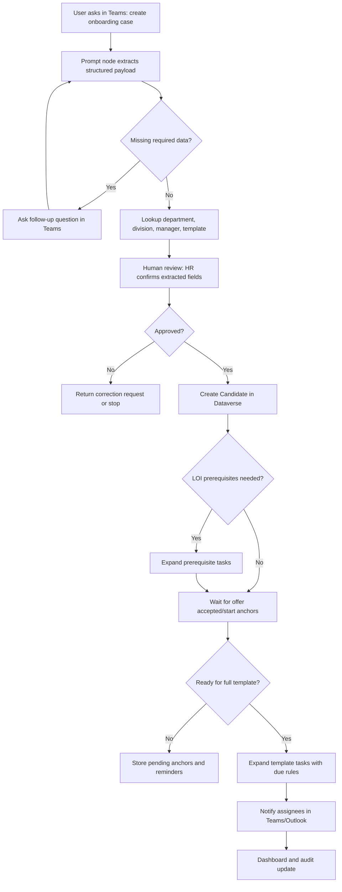
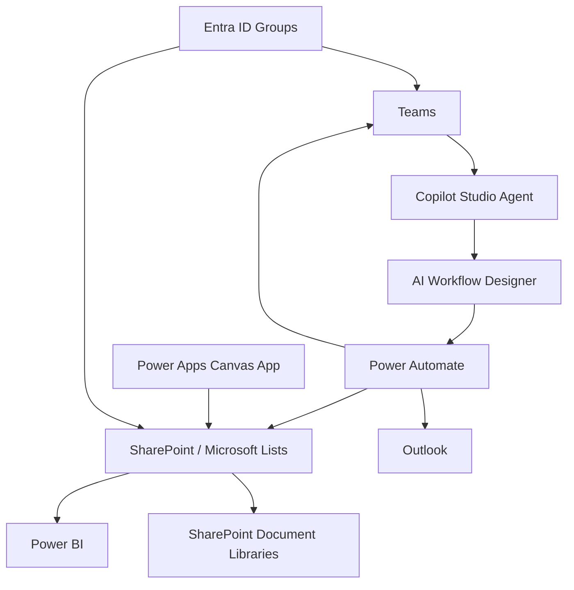
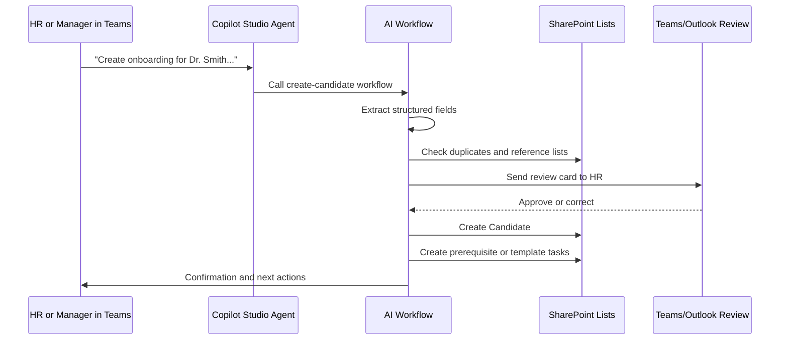
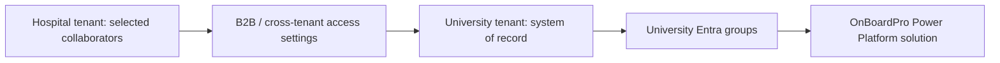
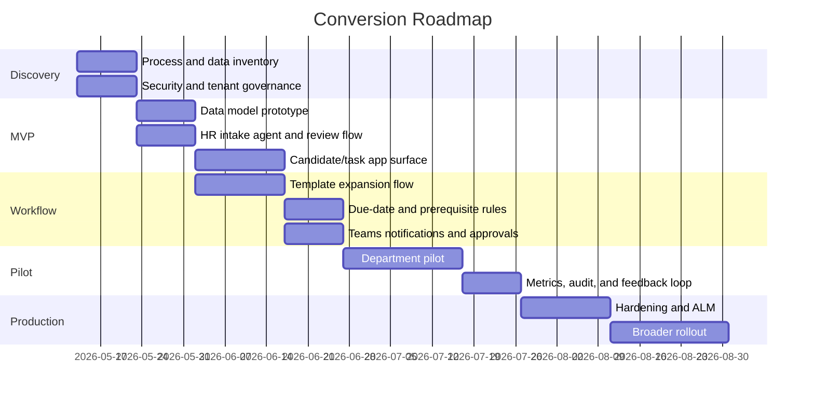

# OnBoardPro to Microsoft 365, Copilot Studio, Teams, and Power Platform

Prepared: 2026-05-12  
Workspace reviewed: `/Users/jonsteen/Documents/GitHub/OnBoardPro`  
Video reviewed: [Microsoft's New AI Workflow Designer in Copilot Studio is Powerful](https://www.youtube.com/watch?v=tAIpd1yOBfk&t=154s), M365 & Modern Tech Hub, uploaded 2026-05-10

## Executive Summary

OnBoardPro is already shaped like a strong Microsoft 365 business process candidate: it has clear candidate records, reusable workflow templates, generated tasks, due-date rules, comments, notifications, roles, stage history, audit logs, and email delivery. The app does not need to be converted into "a chatbot." It should become a Microsoft 365 work system where Teams and Copilot are the front door, Power Apps is the operational UI, Power Automate or Copilot Studio agent flows are the orchestration layer, and either Dataverse or SharePoint/Microsoft Lists is the system of record.

The video's core idea is directly applicable: users describe an intent in natural language, Copilot Studio extracts structured fields, validates missing information, asks for human review, branches through business rules, and then writes to Microsoft 365 data stores. For OnBoardPro, that pattern becomes: "Create an onboarding case for Dr. Jane Smith in Cardiology, LOI signed May 1, start date July 1" -> extract candidate and timeline fields -> verify with HR -> select or suggest a template -> generate tasks -> assign owners -> notify through Teams and Outlook -> track progress.

Recommended direction:

1. Use the **university Microsoft tenant** as the primary environment and system boundary.
2. Use **Dataverse for the durable production solution** if the system will serve multiple departments, require strong row-level security, audit, relational integrity, reporting, and future growth.
3. Use **SharePoint Lists without Dataverse** for a lower-cost departmental pilot, but design the list schema so it can migrate to Dataverse later.
4. Do not place hospital-side PHI in the first version. Treat the hospital tenant as an identity/collaboration boundary until security, compliance, and cross-tenant governance are formally approved.

## What the Video Adds

The video demonstrates a new Copilot Studio AI workflow designer pattern using a leave request example. The transferable concepts are:

| Video concept | What it means | OnBoardPro translation |
|---|---|---|
| Natural-language trigger | User submits free text such as a leave request | HR, manager, or department admin asks Teams/Copilot to create or update onboarding work |
| Prompt node | AI extracts values from messy text | Extract candidate name, department, rank, LOI date, offer dates, start date, template intent, missing fields |
| Structured JSON output | AI response conforms to a schema | Validated onboarding payload before data write |
| Variables | Store extracted values for later steps | Candidate fields, due anchors, assignee targets, template selection |
| If/else branching | Route based on missing data or status | Ask follow-up questions, defer template application, trigger prerequisites, block stage advancement |
| Human review | Send consent/approval to a person | HR confirms extracted data before candidate creation; manager approves stage or task completion |
| Microsoft 365 connectors | Read/write Outlook, SharePoint, profile, manager | Pull manager from Entra/Office profile; send Teams/Outlook cards; create records |
| Agent trigger | Flow can be called by a Copilot Studio agent | "OnBoardPro Agent" in Teams calls create/update/apply-template workflows |
| Activity and analytics | Inspect run details and failures | Operations dashboard for failed automations, missing data, turnaround time |

The important lesson is not "replace Power Automate." It is to use AI where the process has ambiguity and use deterministic business rules where correctness matters.

## Current Codebase Review

### Current Technical Shape

OnBoardPro is a TypeScript monorepo:

| Area | Current implementation | Microsoft 365 target |
|---|---|---|
| Frontend | React 18, Vite, Wouter, TanStack Query, Radix/Tailwind | Power Apps canvas/model-driven app, Teams app, or retained web app |
| Backend | Express REST API | Power Automate, Copilot Studio agent flows, custom connector, or Azure Functions |
| Database | PostgreSQL via Drizzle ORM | Dataverse tables or SharePoint Lists |
| Shared contracts | Zod/Drizzle schemas in `shared/schemas` | Dataverse table schema, Power Fx validation, solution components |
| Auth | Session auth, local/LDAP/OAuth/Azure AD providers | Microsoft Entra ID in university tenant |
| Async workflow | Event bus, background jobs, email outbox | Power Automate flows, approvals, Teams notifications |
| API docs | Swagger/OpenAPI | Custom connector/OpenAPI if existing backend is retained |

### Product Domains Found in the Repo

The codebase is organized around eight bounded contexts:

1. Candidate lifecycle
2. Task management
3. Template management
4. Identity, authentication, and access control
5. Organization and reference data
6. Notification and email delivery
7. Collaboration through comments and mentions
8. Audit and operational controls

These map cleanly to Microsoft 365. Candidate, task, template, department, division, and stage data become tables/lists. Event handlers become flows. Comments become Teams threads or stored comments. Notifications become Teams adaptive cards, Outlook mail, and Power Automate approvals.

### Key Functional Capabilities to Preserve

| Capability | Current codebase behavior | Must preserve in Microsoft 365 |
|---|---|---|
| Candidate creation | Required candidate fields, duplicate email guard, template selection | Intake form or agent flow with validation and duplicate detection |
| Letter of Intent | LOI date is required at creation and anchors prerequisites | Keep as required field for applicable flows |
| Template expansion | Template stages/tasks expand into candidate tasks | Flow or Dataverse plugin-like process expands records |
| Prerequisites | LOI-based prerequisite tasks can expand before offer acceptance | Separate prerequisite expansion workflow |
| Due rules | LOI, offer issued, offer accepted, start date, fixed date, stage-relative | Deterministic date calculation flow, not purely AI |
| Candidate task assignment | User or role assignment, including candidate self | Entra user lookup, security groups, role-based assignment |
| Stage advancement | Current stage can advance when work completes | Scheduled or event-triggered flow checks stage readiness |
| Notifications | Event bus creates in-app and email notifications | Teams/Outlook cards plus optional notification table/list |
| Audit | Audit table logs resource, action, actor, request | Dataverse audit or custom audit table/list, plus Purview retention |
| Dashboard | Metrics, tasks, divisions, recent activity | Power BI, Power Apps views, Teams tabs |

### Current Data Model at a Glance

## Target Operating Model

### Microsoft 365 Experience

### Recommended Agent Set

| Agent | Audience | Main jobs |
|---|---|---|
| OnBoardPro HR Agent | HR staff | Create candidates, apply templates, answer process questions, find overdue work |
| Manager Onboarding Agent | Hiring managers | View candidates, complete assigned tasks, approve stage movement, ask "what is next?" |
| Candidate Self-Service Agent | Candidate/new hire | Ask about visible tasks, submit missing info, confirm forms, receive reminders |
| Template Admin Agent | HR process owners | Draft template changes, compare templates, find weak due rules, generate test timelines |
| Operations Agent | Admins | Explain failed runs, summarize bottlenecks, check audit and notification issues |

## Architecture Option A: Dataverse-Backed Solution

### When to Choose This

Use Dataverse if this will be a production system for multiple departments, regulated onboarding, role-based access, auditable records, reporting, and long-term maintenance. This is the stronger fit for your university-side tenant because the existing app already behaves like a relational business application.

### Option A Architecture

### Dataverse Table Model

| Current table/concept | Dataverse table | Notes |
|---|---|---|
| `candidates` | Candidate | Core onboarding case. Use owner/team ownership and department/division fields. |
| `candidate_tasks` | Candidate Task | Related to Candidate, Template Task, Stage, assigned user/team. |
| `templates` | Onboarding Template | Reusable workflow definition. |
| `template_stages` | Template Stage | Ordered stages with pre-hire/onboarding phase. |
| `template_tasks` | Template Task | Due rule, default assignee, prerequisite flag. |
| `candidate_template_stages` | Candidate Stage Snapshot | Preserve historical template sequence. |
| `candidate_stage_history` | Candidate Stage History | Immutable transitions. |
| `candidate_followers` | Candidate Watcher | Users who receive notifications. |
| `comments` | Candidate/Task Comment | Could also use Teams conversation links for visible discussion. |
| `notifications` | Notification | Optional if Teams/Outlook are enough, useful for audit and dashboards. |
| `departments`, `divisions` | Department, Division | Can map to business units or remain reference tables. |
| `audit_log` | Audit Event | Use Dataverse audit where possible plus a custom audit table for business events. |

### Workflow Pattern from the Video, Applied to OnBoardPro

### Core Agent Flows

| Flow | Trigger | AI use | Deterministic logic |
|---|---|---|---|
| Create Candidate | Agent call from Teams or Power App button | Extract candidate and dates from text | Validate required fields, duplicate check, create Dataverse row |
| Expand Prerequisites | Candidate created with template and LOI date | None or explanation only | Evaluate prerequisite condition and create LOI-based tasks |
| Apply Template | Offer accepted or manual HR action | Optional template recommendation | Expand stages/tasks, compute due dates, create stage history |
| Recompute Due Dates | Date changed | None | Recalculate pending anchor tasks |
| Complete Task | Teams card or Power App action | Optional summarize notes | Update task status, advance stage if possible |
| Stage Review | Stage ready or manager request | Summarize blockers and completed work | Human approval and stage transition |
| Overdue/Due Soon | Scheduled | Generate concise reminder text | Query due tasks and notify assigned users |
| Template Assistant | Template admin asks for help | Draft task names, compare gaps, estimate impact | Human approval before template changes |

### Security Model

Use university Entra groups as the control point. Recommended groups:

| Group | Dataverse role | Purpose |
|---|---|---|
| OBP-System-Admins | System administrator or custom admin | Environment and security management |
| OBP-HR-Staff | HR operations | Full candidate/template/task operations |
| OBP-Department-Admins | Department scoped admin | Manage records in assigned departments |
| OBP-Division-Leaders | Division scoped | View/manage division candidates and tasks |
| OBP-Managers | Manager scoped | View candidates and tasks they own |
| OBP-Candidates | Candidate self-service | Only their visible tasks and comments |
| OBP-Hospital-Collaborators | External/B2B scoped | Only explicitly shared university-side records |

Security options:

1. Use Dataverse business units for major divisions if department/division data boundaries are strict.
2. Use owner/access teams for cross-department collaboration on specific candidates.
3. Use field-level security for sensitive candidate fields.
4. Use DLP policies to keep university onboarding data inside approved connectors.
5. Use managed solutions and separate development, test, and production environments.

### Dataverse Advantages

| Strength | Why it matters for OnBoardPro |
|---|---|
| Relational data | Your template/task/candidate model is relational and already normalized |
| Security roles | Better match to HR, department, manager, and candidate scoped access |
| Auditability | More suitable for a job workflow with personal data |
| Model-driven apps | Faster admin and operations UI for structured records |
| Power BI | Cleaner reporting over normalized tables |
| ALM | Managed solutions support promotion across environments |
| Copilot Studio integration | Better fit for tools, knowledge, and actions |

### Dataverse Tradeoffs

| Tradeoff | Mitigation |
|---|---|
| Licensing and capacity must be verified | Start with a small licensed pilot and capacity estimate |
| More governance required | Use environment strategy, DLP, solution ownership |
| Data model design matters early | Build a minimum viable schema and migrate in waves |
| Cross-tenant identity needs planning | Use university tenant as source and formal B2B/cross-tenant sync |

## Architecture Option B: No Dataverse

### When to Choose This

Choose this when the first goal is a departmental pilot, lower cost, faster proof of concept, or when Dataverse licensing/governance is not ready. This can still use Copilot Studio, Teams, Power Apps, Power Automate, SharePoint, Outlook, and Microsoft 365 Copilot.

### Option B Architecture

### SharePoint List Model

| List | Purpose | Key columns |
|---|---|---|
| Candidates | Core onboarding cases | Name, email, dept, division, manager, LOI, offer issued, offer accepted, start date, status, template |
| Candidate Tasks | Runtime task checklist | Candidate lookup, title, stage, assignee, due date, due rule, priority, status |
| Templates | Reusable workflows | Name, candidate type, active, description |
| Template Stages | Ordered template stages | Template lookup, stage, order, phase |
| Template Tasks | Task definitions in template | Template/stage lookup, rule, assignee, prerequisite |
| Stage History | Candidate stage trail | Candidate, from stage, to stage, changed by, changed at |
| Departments | Reference data | Name, active |
| Divisions | Reference data | Department lookup, name, active |
| Comments | Optional structured comments | Candidate/task lookup, author, body, visibility |
| Notification Log | Optional run trace | Event, recipient, channel, status |

### No-Dataverse Workflow

### SharePoint Advantages

| Strength | Why it helps |
|---|---|
| Lower barrier | Uses standard Microsoft 365 assets many users already understand |
| Fast pilot | Lists, Power Apps, and flows can be created quickly |
| Teams friendly | Lists and Power Apps can be pinned in Teams |
| Good for simple documents | Candidate documents can live in SharePoint libraries |
| No Dataverse dependency | Useful if licensing is not settled |

### SharePoint Tradeoffs

| Risk | Mitigation |
|---|---|
| Complex row-level security is weaker | Use separate sites/lists for strong boundaries or move to Dataverse |
| Relational joins are clumsy | Keep lookup design simple and use Power Automate carefully |
| Delegation/list thresholds can affect scale | Index columns, avoid complex Power Fx filters, use views |
| Audit and lifecycle controls are less business-specific | Add a custom audit list and retain M365 audit logs |
| Migration later may be required | Keep field names and IDs migration-friendly |

## Dataverse vs No Dataverse Decision Matrix

Score: 5 is strongest fit.

| Criteria | Dataverse | No Dataverse, SharePoint Lists | Recommendation |
|---|---:|---:|---|
| Complex relational model | 5 | 2 | Dataverse |
| Multi-role security | 5 | 2 | Dataverse |
| Fast departmental pilot | 3 | 5 | SharePoint |
| Licensing simplicity | 3 | 4 | Depends on tenant licenses |
| Audit/compliance posture | 5 | 3 | Dataverse |
| Future scale | 5 | 2 | Dataverse |
| Maker familiarity | 3 | 4 | SharePoint for pilot |
| Reporting quality | 5 | 3 | Dataverse |
| Migration effort from current app | 4 | 3 | Dataverse if doing full rebuild |

```mermaid
xychart-beta
    title "Architecture Fit Score"
    x-axis ["Security", "Relational Data", "Pilot Speed", "Scale", "Reporting"]
    y-axis "Score" 0 --> 5
    bar "Dataverse" [5, 5, 3, 5, 5]
    bar "SharePoint Lists" [2, 2, 5, 2, 3]
```

## Recommended Data and Process Design

### Preserve Deterministic Workflow Rules

AI should not decide due dates or stage advancement by itself. Use AI to extract, summarize, and explain. Use explicit rules for:

1. LOI, offer issued, offer accepted, and start-date due calculations.
2. Prerequisite eligibility, such as faculty rank requiring P&T.
3. Duplicate detection.
4. Stage advancement.
5. Required versus optional task closure.
6. Candidate-visible versus internal-only comments/tasks.

### Suggested Onboarding Intake Schema

The prompt node should output a schema like this conceptually:

| Field | Required | Source |
|---|---|---|
| candidateFirstName | Yes | User message or follow-up |
| candidateLastName | Yes | User message or follow-up |
| candidateEmail | Yes | User message or follow-up |
| candidateType | Yes | Reference lookup |
| department | Yes | Reference lookup |
| division | Optional | Reference lookup |
| manager | Optional | Entra lookup |
| facultyRank | Conditional | Required for faculty flows |
| letterOfIntentDate | Yes | User message or follow-up |
| offerIssuedDate | Optional | User message or later update |
| offerAcceptedDate | Optional | User message or later update |
| anticipatedStartDate | Optional initially | Required before onboarding stage |
| templateName | Yes or suggested | Template lookup |
| missingInformation | Yes | AI-generated array used for follow-up |

### Human Review Placement

Human review should happen at these points:

| Step | Reviewer | Why |
|---|---|---|
| Before candidate creation | HR staff | Prevent bad AI extraction from becoming a record |
| Before template application | HR staff or department admin | Confirm correct workflow |
| Before stage advancement if blocked | Manager or HR | Resolve exceptions |
| Before candidate-visible messages | HR or owner | Avoid sending wrong instructions |
| Before template changes | Template owner | Keep process governance intact |

## Tenant Strategy

### University Tenant as Primary

Use the university tenant for:

1. Power Platform environments.
2. Copilot Studio agents.
3. Dataverse or SharePoint data.
4. Teams channels/tabs.
5. Power BI dashboards.
6. Security groups and DLP policies.

### Hospital Tenant Handling

Because you have a university tenant and a hospital tenant, treat this as a cross-tenant identity and data governance problem.

Recommended first version:

1. Keep the system of record in the university tenant.
2. Add hospital-side participants only when there is a clear business need.
3. Use Microsoft Entra B2B collaboration or cross-tenant synchronization for selected users.
4. Do not replicate hospital data into the university tenant until compliance approves the data classes.
5. Avoid PHI in candidate records unless the system is reviewed as a healthcare-sensitive workload.

## Teams Design

Recommended Teams structure:

| Team/channel | Purpose |
|---|---|
| OnBoardPro Operations | HR and admins manage day-to-day onboarding |
| Department onboarding channels | Department-specific coordination |
| Private channel per sensitive group | Restricted candidate workflows if needed |
| Pinned Power App tab | Operational dashboard and forms |
| Pinned OnBoardPro Agent | Natural language actions and Q&A |
| Approvals app | Manager/HR approvals |

Agent experiences:

1. Personal Teams chat for "my tasks" and "what is overdue?"
2. Team/channel scoped agent for department operations.
3. Power App embedded in Teams for record editing.
4. Teams adaptive cards for task completion and approvals.

## Migration Roadmap

### Phase Details

| Phase | Output | Success measure |
|---|---|---|
| 0. Governance | Tenant, environment, DLP, data classification decisions | Approved architecture boundary |
| 1. Model | Dataverse tables or SharePoint lists | Candidate/template/task records work end to end |
| 2. Intake agent | Teams agent with AI extraction and HR review | Creates clean candidate drafts |
| 3. Template engine | Flow expands templates to candidate tasks | Due dates match current app behavior |
| 4. Notifications | Teams/Outlook cards and reminders | Assignees can act without opening full app |
| 5. Dashboards | Power BI or Power Apps views | HR can see overdue, blocked, stage progress |
| 6. Pilot | One department or hiring workflow | Reduced manual tracking and fewer missed tasks |
| 7. Production | Managed solution, monitoring, runbooks | Stable multi-department operation |

## Risks and Controls

| Risk | Why it matters | Control |
|---|---|---|
| AI extraction error | Wrong candidate data or dates | Human review before writes; schema validation |
| AI hallucination | Incorrect policy or process answers | Ground agents in approved SharePoint/Dataverse knowledge |
| PHI/PII leakage | University/hospital boundary | Data classification, DLP, no PHI in MVP |
| Cross-tenant identity confusion | Hospital users may need access | B2B/cross-tenant settings, scoped groups |
| SharePoint scale limits | Lists can degrade with complex queries | Index columns, archive, or choose Dataverse |
| Approval wait limits | Long processes can outlast flow waits | Store approval state in table/list and resume with events |
| Connector throttling | Bulk task expansion can hit limits | Batch operations, retry policy, capacity planning |
| Role drift | Wrong users can see records | Group-based access review and audit |
| Template sprawl | Too many variants become ungovernable | Template owner, lifecycle, activation checks |

## Implementation Recommendation

### Best Production Architecture

Use:

1. Dataverse for structured onboarding records.
2. SharePoint for documents and knowledge content.
3. Teams as the daily workspace.
4. Copilot Studio as the natural-language and agent orchestration layer.
5. Copilot Studio AI workflows or agent flows for AI extraction, branching, human review, and calls into data operations.
6. Power Automate for scheduled reminders, approvals, notifications, and integrations.
7. Power Apps for the structured operational UI.
8. Power BI for leadership and process analytics.

### Best Pilot Architecture

Use:

1. SharePoint Lists for core tables.
2. A Teams-pinned Power Apps canvas app.
3. A Copilot Studio agent for intake and task lookup.
4. Power Automate approvals and Teams adaptive cards.
5. A migration-ready schema that mirrors the Dataverse table design.

### Practical Path

Start with a **SharePoint pilot only if licensing or environment governance blocks Dataverse**. Otherwise, start in Dataverse. The current codebase is normalized and process-heavy enough that Dataverse is the cleaner long-term match.

## Source Notes

Local codebase sources reviewed:

- `README.md`
- `docs/ARCHITECTURE.md`
- `docs/DOMAIN_GLOSSARY.md`
- `docs/TEMPLATE_SYSTEM.md`
- `docs/DUE_RULES_AND_TEMPLATES_GUIDE.md`
- `docs/email-system.md`
- `docs/BOUNDED_CONTEXTS.md`
- `shared/schemas/*`
- `server/services/*`
- `server/routes/*`
- `server/events/*`

Microsoft and web sources reviewed:

- [Video: Microsoft's New AI Workflow Designer in Copilot Studio is Powerful](https://www.youtube.com/watch?v=tAIpd1yOBfk&t=154s)
- [Add a prompt node to an agent flow or workflow](https://learn.microsoft.com/en-us/microsoft-copilot-studio/prompt-node-workflow)
- [Create an agent flow as a tool](https://learn.microsoft.com/en-us/power-virtual-agents/advanced-flow-create)
- [Add an agent flow to an agent as a tool](https://learn.microsoft.com/en-us/microsoft-copilot-studio/flow-agent)
- [Add an agent node to an agent flow](https://learn.microsoft.com/en-us/microsoft-copilot-studio/agent-node-workflow)
- [Publish and deploy Copilot Studio agents](https://learn.microsoft.com/en-us/microsoft-copilot-studio/publication-fundamentals-publish-channels)
- [Copilot connectors versus Power Platform connectors as knowledge sources](https://learn.microsoft.com/en-us/microsoft-copilot-studio/knowledge-graph-vs-power-platform-connectors)
- [Add SharePoint as a knowledge source](https://learn.microsoft.com/en-ie/microsoft-copilot-studio/knowledge-add-sharepoint)
- [Assign security roles in Power Platform](https://learn.microsoft.com/en-us/power-platform/admin/assign-security-roles)
- [Use access teams and owner teams in Dataverse](https://learn.microsoft.com/en-us/power-apps/developer/data-platform/use-access-teams-owner-teams-collaborate-share-information)
- [Dataverse for Teams known issues and limitations](https://learn.microsoft.com/en-us/power-apps/teams/known-issues-limitations)
- [Power Automate limits and configuration](https://learn.microsoft.com/en-us/power-automate/limits-and-config)
- [Understand platform limits and avoid throttling](https://learn.microsoft.com/en-us/power-automate/guidance/coding-guidelines/understand-limits)
- [Power Automate approvals known issues](https://learn.microsoft.com/en-us/power-automate/approvals-known-issues)
- [Entra cross-tenant access settings](https://learn.microsoft.com/en-us/entra/external-id/cross-tenant-access-settings-b2b-collaboration)
- [Microsoft 365 multitenant people search](https://learn.microsoft.com/en-us/microsoft-365/enterprise/multi-tenant-people-search?view=o365-worldwide)
